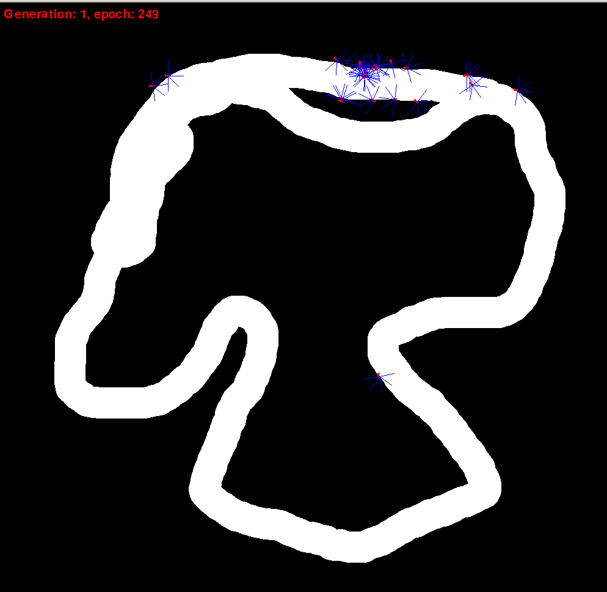

# cars
A demo of self navigating cars learning to race around the track

I wrote it in one evening for my friend's kid to show him 'cool stuff'. 
This is by no means a serious attempt to create a self navigating car.
 

 
Feel free to use for any non-commercial purpose.    
        
## Instructions
  - python 3.6+         
  - download the code
  - install the requirements using pip or conda (e.g. `pip install requirements.txt`)
  - run by executing `python main.py`
  
  The cars are generated by random mutation of the 'parent' - the cars that were choosen 
  in previous generation as best performing. You can select parents by clicking on them.
  Pressing space finishes the round and restarts the world with the next generation of cars.
  
  Exit the program by either closing the window or pressing ESC.
  
## How it works
  The program operates in a very simple way. 
  
  Each car is equipped with a set of sensors that provide a distance 
  to a route boundary in the direction the sensor is facing. 
  
  The car has a 'driver' that interprets the sensor readings and 
  produces two signals: acceleration and turn, that in turn affect the car
  speed and direction. The provided implementation is a simple Neural Network with 
  5 input nodes (one per each sensor), 10 hidden nodes, and 2 output nodes (for acceleration and turn). 
  
  Initially the driver is generated randomly, however in each consecutive round,
  the drivers are created by randomly mutation a set of 'parents' that were selected
  among cars of previous generation. This very simple technique akin to 'Genetic Programming'
  is powerful enough to create drivers capable of completing the track in 3-5 rounds.  
  
## License
   
  Copyright (C) 2020 
    
  This program is free software: you can redistribute it and/or modify
  it under the terms of the GNU General Public License as published by
  the Free Software Foundation, either version 3 of the License, or
  (at your option) any later version.
    
  This program is distributed in the hope that it will be useful,
  but WITHOUT ANY WARRANTY; without even the implied warranty of
  MERCHANTABILITY or FITNESS FOR A PARTICULAR PURPOSE.  See the
  GNU General Public License for more details.
    
  You should have received a copy of the GNU General Public License
  along with this program.  If not, see <https://www.gnu.org/licenses/>.
     
